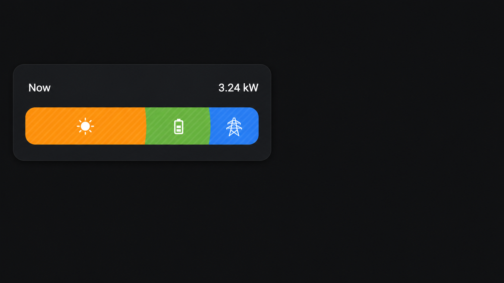

# HA Energy Flow Card

A compact Home Assistant card that shows how much of the home's consumption
comes from solar, battery, and grid sources.



The card reads both modes directly from the Energy dashboard configuration:

- **Power** uses the current `stat_rate` entities configured for solar, grid,
  and battery sources. Its bar is animated to indicate live data.
- **Energy** uses the recorder statistics for the active Energy dashboard
  period. Its bar is static.

No source entity has to be configured in the card.

## Features

- Power/Energy mode selection in the visual editor
- Native-style tap, hold, and double-tap interactions
- Live Power composition with animation
- Period-based Energy composition without animation
- Composition bar automatically fills the available card height
- Defaults to a 6-column, content-height layout in Sections views
- Uses Home Assistant's Energy dashboard source configuration
- Uses the active Energy collection period
- Defaults to today's Energy dashboard statistics without a collection key
- Shows localized relative period names and falls back to exact dates
- Uses Home Assistant's language, number format, units, colors, and themes
- Handles grid export and battery charging before assigning home-consumption
  shares
- Includes a built-in visual card editor
- Groups settings into expandable Configuration and Interactions sections
- Honors the operating system's reduced-motion preference

## Requirements

- A configured Home Assistant Energy dashboard
- Solar, grid, or battery Energy sources
- Recorder statistics for Energy mode
- Power sensors configured in the Energy dashboard for Power mode

Home Assistant only exposes a live source when a power sensor is configured for
that Energy source. Missing Power sources are treated as zero.

## HACS installation

[](https://my.home-assistant.io/redirect/hacs_repository/?owner=psym88&repository=ha_energy-flow-card&category=plugin)

1. Open HACS and select **Custom repositories** from the three-dot menu.
2. Add `https://github.com/psym88/ha_energy-flow-card` with the **Dashboard**
   category.
3. Install **HA Energy Flow Card**.
4. Reload Home Assistant and clear the browser cache if necessary.

HACS normally registers this resource automatically:

```text
/hacsfiles/ha_energy-flow-card/ha_energy-flow-card.js?hacstag=…
```

## Configuration

```yaml
type: custom:ha_energy-flow-card
default_mode: power
show_card: true
tap_action:
  action: none
hold_action:
  action: none
double_tap_action:
  action: none
```

Without a `collection_key`, Energy mode displays today's values. To share the
active period with the Energy period selector or other Energy cards, configure
the same key on every related card:

```yaml
type: custom:ha_energy-flow-card
collection_key: energy_1
```

| Option | Required | Default | Description |
| --- | --- | --- | --- |
| `collection_key` | No | Today | Optional shared Energy collection key; it must start with `energy_` |
| `default_mode` | No | `power` | Initial mode: `power` or `energy` |
| `title` | No | Empty | Optional card title |
| `show_card` | No | `true` | Whether to render the Home Assistant card background |
| `tap_action` | No | `none` | Home Assistant tap action, including Browser Mod DOM events |
| `hold_action` | No | `none` | Home Assistant hold action |
| `double_tap_action` | No | `none` | Home Assistant double-tap action |

All options are available in the visual editor. Power mode displays Home
Assistant's localized **Now** label; Energy mode displays its localized
relative period name, such as **Today**, **Yesterday**, or **Last week**.
Periods without a Home Assistant name display an exact date or date range.
Tap, hold, and double-tap actions are grouped in the **Interactions** section.
Title, default view, Energy collection key, and card background are grouped in
the **Configuration** section. The Energy collection key is only shown when
Energy is selected.

Browser Mod popup example:

```yaml
type: custom:ha_energy-flow-card
default_mode: power
tap_action:
  action: fire-dom-event
  browser_mod:
    service: browser_mod.popup
    data:
      popup_card_id: power
```

## How values are calculated

Power mode reads the current rate entities from the Energy dashboard and
normalizes their units to watts. Energy mode reads the dashboard's normalized
kWh statistics for its selected period.

For both modes, the card follows Home Assistant's source-routing order:

1. Grid surplus can charge the battery.
2. Solar can charge the battery.
3. Solar can be exported to the grid.
4. Battery power can be exported to the grid.
5. Remaining solar, battery, and grid values are assigned to home consumption.

Energy routing is calculated separately for every recorder interval and only
then summed. This avoids incorrect source shares when flows change direction
within the selected period.

## Manual installation

Copy `ha_energy-flow-card.js` to `/config/www/ha_energy-flow-card.js`, then
register `/local/ha_energy-flow-card.js` as a JavaScript module.

## Development

```bash
npm run check
npm test
```

Edit `ha_energy-flow-card.js` directly. The card is intentionally kept as a
single dependency-free file and requires no build step.

## Language policy

Repository code, comments, user-facing strings, documentation, examples,
release notes, and commit messages must be written in English. See
[AGENTS.md](AGENTS.md).

## License

[MIT](LICENSE)
